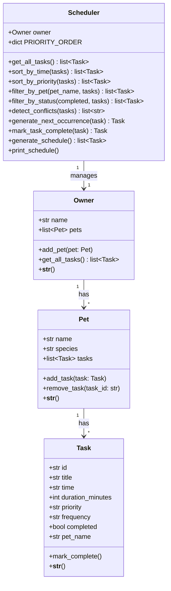

```mermaid
classDiagram
    class Task {
        +str id
        +str title
        +str time
        +int duration_minutes
        +str priority
        +str frequency
        +bool completed
        +str pet_name
        +mark_complete()
        +__str__()
    }
    class Pet {
        +str name
        +str species
        +list~Task~ tasks
        +add_task(task: Task)
        +remove_task(task_id: str)
        +__str__()
    }
    class Owner {
        +str name
        +list~Pet~ pets
        +add_pet(pet: Pet)
        +get_all_tasks() list~Task~
        +__str__()
    }
    class Scheduler {
        +Owner owner
        +dict PRIORITY_ORDER
        +get_all_tasks() list~Task~
        +sort_by_time(tasks) list~Task~
        +sort_by_priority(tasks) list~Task~
        +filter_by_pet(pet_name, tasks) list~Task~
        +filter_by_status(completed, tasks) list~Task~
        +detect_conflicts(tasks) list~str~
        +generate_next_occurrence(task) Task
        +mark_task_complete(task) Task
        +generate_schedule() list~Task~
        +print_schedule()
    }
    Owner "1" --> "*" Pet : has
    Pet "1" --> "*" Task : has
    Scheduler "1" --> "1" Owner : manages
```
